[TryHackMe Room](https://tryhackme.com/room/btwindowsinternals)


{ type=application/pdf }

In this room, we will explore the core processes within a Windows system. This room aims to help you know and understand what normal behaviour within a Windows operating system is. This foundational knowledge will help you identify malicious processes running on an endpoint. 

## System

The first Windows process on the list is System. It was mentioned in a previous section that a PID for any given process is assigned at random, but that is not the case for the System process. The PID for System is always 4. What does this process do exactly?

> "The System process (process ID 4) is the home for a special kind of thread that runs only in kernel mode a kernel-mode system thread. System threads have all the attributes and contexts of regular user-mode threads (such as a hardware context, priority, and so on) but are different in that they run only in kernel-mode executing code loaded in system space, whether that is in Ntoskrnl.exe or in any other loaded device driver. In addition, system threads don't have a user process address space and hence must allocate any dynamic storage from operating system memory heaps, such as a paged or nonpaged pool."


> Image Path: C:\Windows\system32\ntoskrnl.exe (NT OS Kernel)
> Parent Process: System Idle Process (0)

## smss.exe (Session Manager Subsystem)

This process starts the kernel and user modes of the Windows subsystem. This subsystem includes win32k.sys (kernel mode), winsrv.dll (user mode), and csrss.exe (user mode). 

Smss.exe starts csrss.exe (Windows subsystem) and wininit.exe in Session 0, an isolated Windows session for the operating system, and csrss.exe and winlogon.exe for Session 1, which is the user session. The first child instance creates child instances in new sessions, done by smss.exe copying itself into the new session and self-terminating. You can read more about this process here.

### Normal 

> - Image Path:  %SystemRoot%\System32\smss.exe
> - Parent Process:  System
> - Number of Instances:  One master instance and child instance per session. The child instance exits after creating the session.
> - User Account:  Local System
> - Start Time:  Within seconds of boot time for the master instance

### What is unusual?

> - A different parent process other than System (4)
> - The image path is different from C:\Windows\System32
> - More than one running process. (children self-terminate and exit after each new session)
> - The running User is not the SYSTEM user
> - Unexpected registry entries for Subsystem

## csrss.exe (Client Server Runtime Process)

user-mode side of the Windows subsystem. This process is always running and is critical to system operation. If this process is terminated by chance, it will result in system failure. This process is responsible for the Win32 console window and process thread creation and deletion. For each instance, csrsrv.dll, basesrv.dll, and winsrv.dll are loaded (along with others). 


This process is also responsible for making the Windows API available to other processes, mapping drive letters, and handling the Windows shutdown process. You can read more about this process here.

### Normal
> - Image Path:  %SystemRoot%\System32\csrss.exe
> - Parent Process:  Created by an instance of smss.exe
> - Number of Instances:  Two or more
> - User Account:  Local System
> - Start Time:  Within seconds of boot time for the first two instances (for Session 0 and 1). Start times for additional instances occur as new sessions are created, although only Sessions 0 and 1 are often created.

### What is unusual?

> - An actual parent process. (smss.exe calls this process and self-terminates)
> - Image file path other than C:\Windows\System32
> - Subtle misspellings to hide rogue processes masquerading as csrss.exe in plain sight
> - The user is not the SYSTEM user.

## Windows Initialization Process, wininit.exe

responsible for launching services.exe (Service Control Manager), lsass.exe (Local Security Authority), and lsaiso.exe within Session 0. It is another critical Windows process that runs in the background, along with its child processes. 

> Note: lsaiso.exe is a process associated with Credential Guard and KeyGuard. You will only see this process if Credential Guard is enabled. 

### Normal

> - Image Path:  %SystemRoot%\System32\wininit.exe
> - Parent Process:  Created by an instance of smss.exe
> - Number of Instances:  One
> - User Account:  Local System
> - Start Time:  Within seconds of boot time

### What is unusual?

> - An actual parent process. (smss.exe calls this process and self-terminates)
> - Image file path other than C:\Windows\System32
> - Subtle misspellings to hide rogue processes in plain sight
> - Multiple running instances
> - Not running as SYSTEM

## Service Control Manager (SCM) or services.exe

Its primary responsibility is to handle system services: loading services, interacting with services and starting or ending services. It maintains a database that can be queried using a Windows built-in utility, sc.exe. 

``` 
C:\Users\Administrator> sc.exe
DESCRIPTION:
        SC is a command line program used for communicating with the
        Service Control Manager and services.
USAGE:
        sc <server> [command] [service name] <option1> <option2>...
```

Information regarding services is stored in the registry, `HKLM\System\CurrentControlSet\Services. `

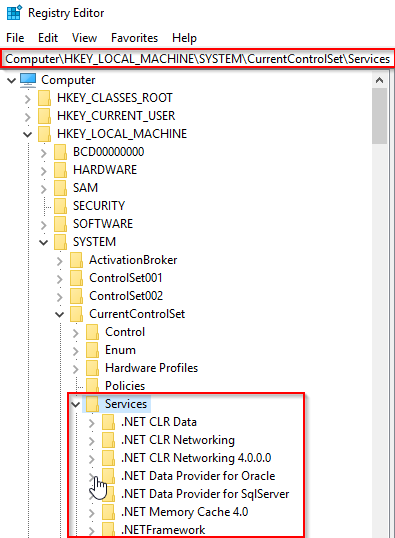

When a user logs into a machine successfully, this process is responsible for setting the value of the Last Known Good control set (Last Known Good Configuration), ``HKLM\System\Select\LastKnownGood``, to that of the CurrentControlSet. 

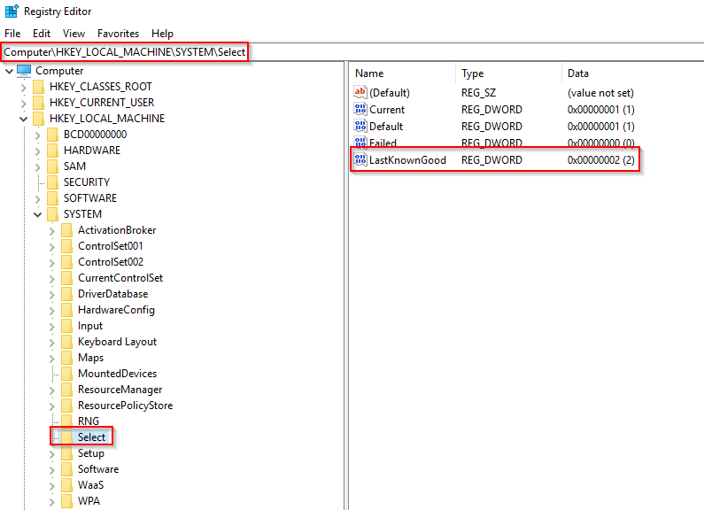

This process is the parent to several other key processes: svchost.exe, spoolsv.exe, msmpeng.exe, and dllhost.exe


### What is normal?

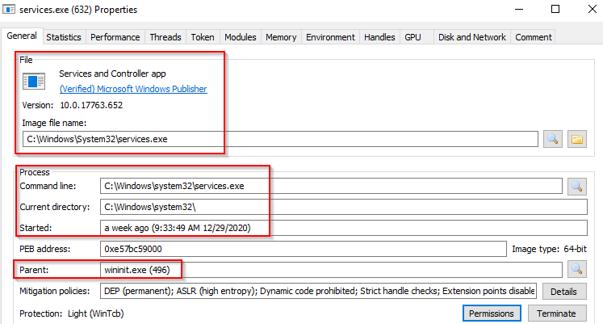

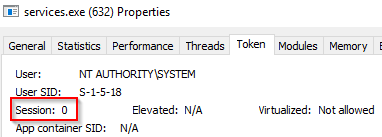


> - Image Path:  %SystemRoot%\System32\services.exe
> - Parent Process:  wininit.exe
> - Number of Instances:  One
> - User Account:  Local System
> - Start Time:  Within seconds of boot time

### What is unusual?

> - A parent process other than wininit.exe
> - Image file path other than C:\Windows\System32
> - Subtle misspellings to hide rogue processes in plain sight
> - Multiple running instances
> - Not running as SYSTEM

## Service Host (Host Process for Windows Services), or svchost.exe

responsible for hosting and managing Windows services. 

The services running in this process are implemented as DLLs. The DLL to implement is stored in the registry for the service under the Parameters subkey in ServiceDLL. The full path is ``HKLM\SYSTEM\CurrentControlSet\Services\SERVICE NAME\Parameters``

Since svchost.exe will always have multiple running processes on any Windows system, this process has been a target for malicious use. Adversaries create malware to masquerade as this process and try to hide amongst the legitimate svchost.exe processes. They can name the malware svchost.exe or misspell it slightly, such as scvhost.exe. By doing so, the intention is to go under the radar. Another tactic is to install/call a malicious service (DLL).  

### What is normal?

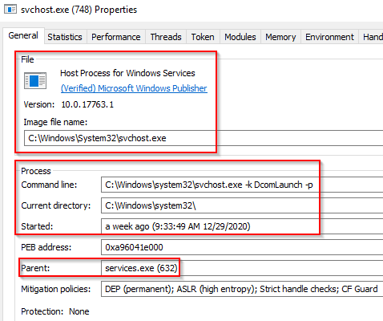

> - Image Path: %SystemRoot%\System32\svchost.exe
> - Parent Process: services.exe
> - Number of Instances: Many
> - User Account: Varies (SYSTEM, Network Service, Local Service) depending on the svchost.exe instance. In Windows 10, some instances run as the logged-in user.
> - Start Time: Typically within seconds of boot time. Other instances of svchost.exe can be started after boot.

### What is unusual?

> - A parent process other than services.exe
> - Image file path other than C:\Windows\System32
> - Subtle misspellings to hide rogue processes in plain sight
> - The absence of the -k parameter


## Local Security Authority Subsystem Service (LSASS)

responsible for enforcing the security policy on the system. It verifies users logging on to a Windows computer or server, handles password changes, and creates access tokens. It also writes to the Windows Security Log.

It creates security tokens for SAM (Security Account Manager), AD (Active Directory), and NETLOGON. It uses authentication packages specified in ``HKLM\System\CurrentControlSet\Control\Lsa.``
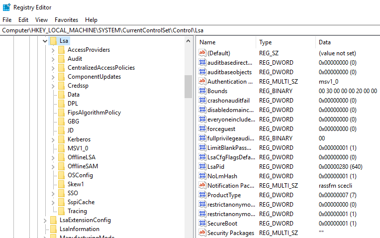

Lsass.exe is another process adversaries target. Common tools such as **mimikatz** are used to dump credentials, or adversaries mimic this process to hide in plain sight. Again, they do this by either naming their malware by this process name or simply misspelling the malware slightly. 

### What is normal?

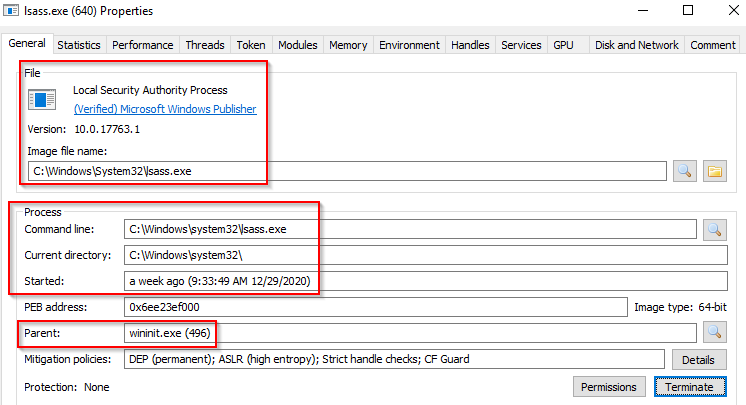

> - Image Path:  %SystemRoot%\System32\lsass.exe
> - Parent Process:  wininit.exe
> - Number of Instances:  One
> - User Account:  Local System
> - Start Time:  Within seconds of boot time

### What is unusual?

> - A parent process other than wininit.exe
> - Image file path other than C:\Windows\System32
> - Subtle misspellings to hide rogue processes in plain sight
> - Multiple running instances
> - Not running as SYSTEM

## Windows Logon, winlogon.exe

responsible for handling the Secure Attention Sequence (SAS). It is the ALT+CTRL+DELETE key combination users press to enter their username & password. 

This process is also responsible for loading the user profile. It loads the user's NTUSER.DAT into HKCU, and userinit.exe loads the user's shell.
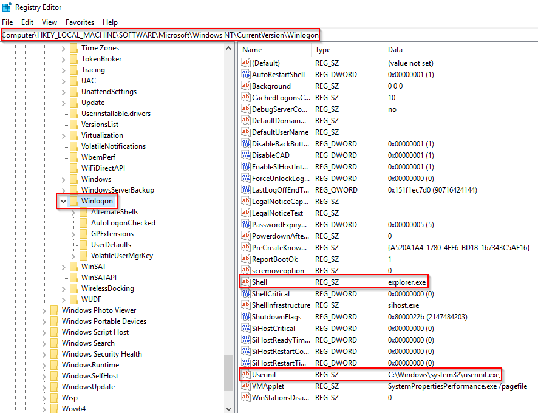

### What is normal?

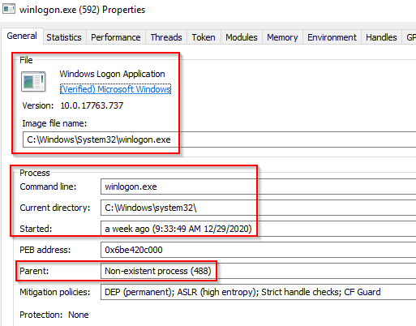

Winlogon properties (2).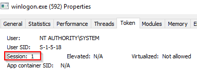

> - Image Path:  %SystemRoot%\System32\winlogon.exe
> - Parent Process:  Created by an instance of smss.exe that exits, so analysis tools usually do not provide the parent process name.
> - Number of Instances:  One or more
> - User Account:  Local System
> - Start Time:  Within seconds of boot time for the first instance (for Session 1). Additional instances occur as new sessions are created, typically through Remote Desktop or Fast User Switching logons.

### What is unusual?

> - An actual parent process. (smss.exe calls this process and self-terminates)
> - Image file path other than C:\Windows\System32
> - Subtle misspellings to hide rogue processes in plain sight
> - Not running as SYSTEM
> - Shell value in the registry other than explorer.exe

## Windows Explorer, explorer.exe

gives the user access to their folders and files. It also provides functionality for other features, such as the Start Menu and Taskbar.

As mentioned previously, the Winlogon process runs userinit.exe, which launches the value in ``HKLM\Software\Microsoft\Windows NT\CurrentVersion\Winlogon\Shell``. Userinit.exe exits after spawning explorer.exe. Because of this, the parent process is non-existent. 

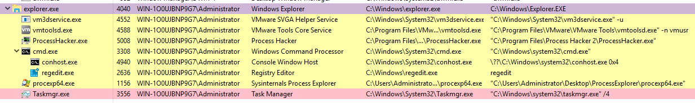

### What is normal?

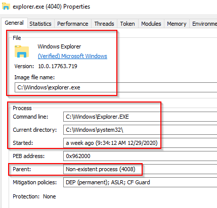

> - Image Path:  %SystemRoot%\explorer.exe
> - Parent Process:  Created by userinit.exe and exits
> - Number of Instances:  One or more per interactively logged-in user
> - User Account:  Logged-in user(s)
> - Start Time:  First instance when the first interactive user logon session begins

What is unusual?

> - An actual parent process. (userinit.exe calls this process and exits)
> - Image file path other than C:\Windows
> - Running as an unknown user
> - Subtle misspellings to hide rogue processes in plain sight
> - Outbound TCP/IP connections

## Conclusion 

The information for this room is derived from multiple sources.

    https://0xcybery.github.io/blog/Core-Processes-In-Windows-System
    https://www.sans.org/posters/hunt-evil/
    https://docs.microsoft.com/en-us/sysinternals/resources/windows-internals

Other links are provided throughout the room. Reading them at your own leisure to further your foundation and understanding of the core Windows processes is encouraged.

