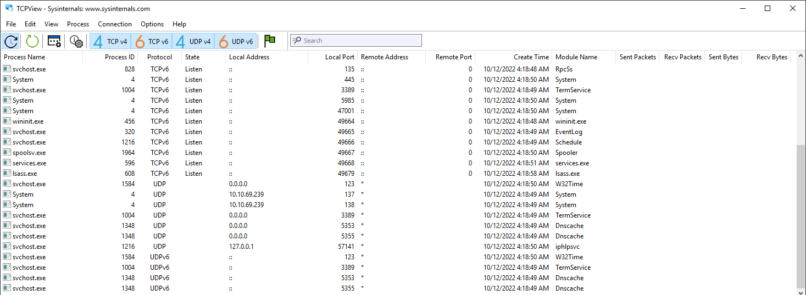

[TryHackMe Room](https://tryhackme.com/room/btsysinternalssg)

## File and Disk Utilities

### Sigcheck

> shows file version number, timestamp information, and digital signature details, including certificate chains.
>It also includes an option to check a file’s status on VirusTotal

Use Case: Check for unsigned files in C:\Windows\System32.

Command: `sigcheck -u -e C:\Windows\System32`

- `-u` "If VirusTotal check is enabled, show files that are unknown by VirusTotal or have non-zero detection, otherwise show only unsigned files."
- `-e` "Scan executable images only (regardless of their extension)"

### Streams

"The NTFS file system provides applications the ability to create alternate data streams of information. By default, all data is stored in a file's main unnamed data stream, but by using the syntax 'file:stream', you are able to read and write to alternates." (official definition)

Alternate Data Streams (ADS) is a file attribute specific to Windows NTFS (New Technology File System). Every file has at least one data stream ($DATA) and ADS allows files to contain more than one stream of data. Natively Window Explorer doesn't display ADS to the user. There are 3rd party executables that can be used to view this data, but Powershell gives you the ability to view ADS for files.

Malware writers have used ADS to hide data in an endpoint, but not all its uses are malicious. When you download a file from the Internet unto an endpoint, there are identifiers written to ADS to identify that it was downloaded from the Internet.

Screenshot showing the execution of streams using the command prompt

Example: A file downloaded from the Internet.

Screenshot showing the execution of streams against SysinternalsSuite.zip

Since the file has this identifier, additional security measures are added to its properties.

Screenshot showing the file properties of SysinternalsSuite.zip

You can read more on streams here. 

## Networking Utilities

### TCPView

> TCPView is a Windows program that will show you detailed listings of all TCP and UDP endpoints on your system, including the local and remote addresses and state of TCP connections. On Windows Server 2008, Vista, and XP, TCPView also reports the name of the process that owns the endpoint. TCPView provides a more informative and conveniently presented subset of the Netstat program that ships with Windows. The TCPView download includes Tcpvcon, a command-line version with the same functionality.

The below image shows the default view for TCPView.

We can apply additional filtering by turning off TCP v4, TCP v6, UDP v4, and UDP v6 at the top toolbar, depending on which protocols we want to display. Moreover, we can click on the green flag to use the States Filter.

Clicking the green flag opens the States Filter, which provides an extensive list of options to select which connection states we want to display. Most of the connection states available apply only to TCP connections.

## Process Utilities

### ProcDump

"ProcDump is a command-line utility whose primary purpose is monitoring an application for CPU spikes and generating crash dumps during a spike that an administrator or developer can use to determine the cause of the spike." (official definition)

Alternatively, you can use Process Explorer to do the same.

Right-click on the process to create a Minidump or Full Dump of the process.

Screenshot showing the Create Dump option after right clicking on a process

Please refer to the examples listed on the ProcDump page to learn about all the available options with running this tool. 

### Autoruns

>"This utility, which has the most comprehensive knowledge of auto-starting locations of any startup monitor, shows you what programs are configured to run during system bootup or login, and when you start various built-in Windows applications like Internet Explorer, Explorer and media players. These programs and drivers include ones in your startup folder, Run, RunOnce, and other Registry keys. Autoruns reports Explorer shell extensions, toolbars, browser helper objects, Winlogon notifications, auto-start services, and much more. Autoruns goes way beyond other autostart utilities." 

This is a good tool to search for any malicious entries created in the local machine to establish Persistence.

## Security Utilities

### Sysmon

>"System Monitor (Sysmon) is a Windows system service and device driver that, once installed on a system, remains resident across system reboots to monitor and log system activity to the Windows event log. It provides detailed information about process creations, network connections, and changes to file creation time. By collecting the events it generates using Windows Event Collection or SIEM agents and subsequently analyzing them, you can identify malicious or anomalous activity and understand how intruders and malware operate on your network."

Sysmon is a comprehensive tool, and it can't be summarized in just one section.

Check out the Sysmon  to further learn what Sysmon is and how to use it.

Link: https://docs.microsoft.com/en-us/sysinternals/downloads/security-utilities

## System Information

### WinObj

>"WinObj is a 32-bit Windows NT program that uses the native Windows NT API (provided by NTDLL.DLL) to access and display information on the NT Object Manager's name space."

## Miscellaneous