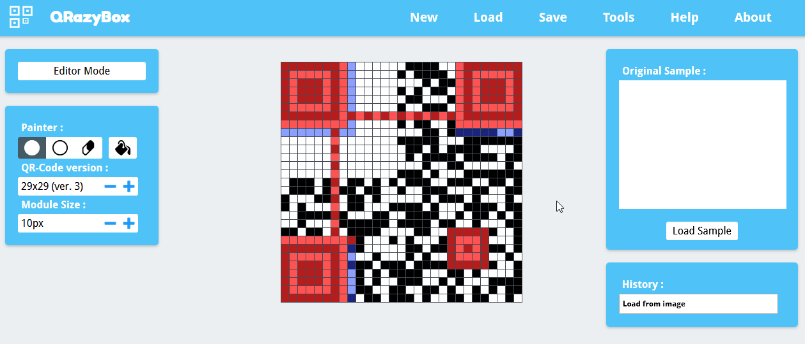
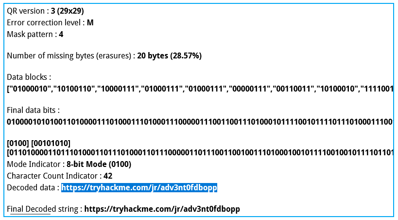
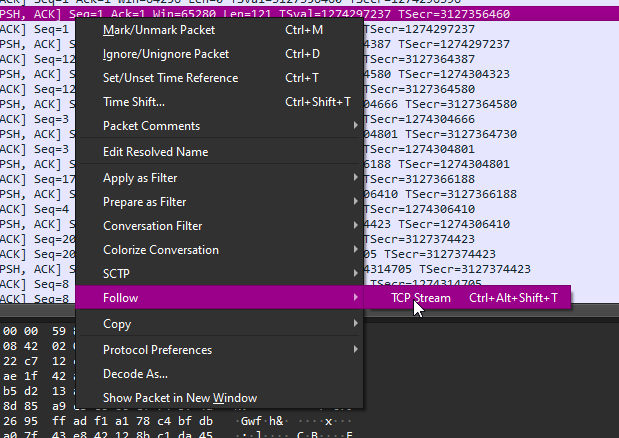
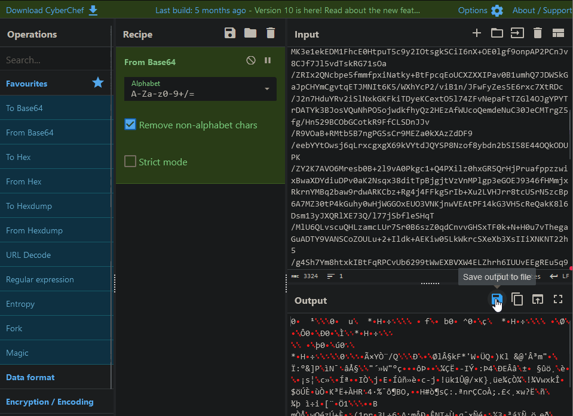

I had the Advent of Cyber '23 on my calendar for Dec 1, and I wasn't sure what I was in for, this would be my first AOC, so, while I had some free time I logged the day before only to see there's another room released on my dashboard


ooh a Side Quest, I wonder if I can do something there while I wait for the main event

## QR code social media, finding the room

So in the try hack me [Advent of Cyber '23 Side Quest](https://tryhackme.com/room/adventofcyber23sidequest) room it says the first of four challenges will be a hidden room that you can get access to via QR code parts hidden in there social pages between Tuesday, 28th November and Thursday, 30th November, hey! today is the 30th, so I can go looking for them ahead of time and be prepared.


so lets get looking

first I try there linked-in, scroll to find what was posted on the dates provided in the clue (between Tuesday, 28th November and Thursday, 30th November)


huh 🥚👀 lets see what that link gets us


ahh, so its a bisected qr-code, I thought it would be multiple QR codes with data in them that you had to read, but this is interesting because if theres only one QR code maybe I can use the parts of it to figure out the rest, but first I should find what else is available

well thay gave us a list, so lets follow it in order.

There discord is up next, im already there so lets see whats up


a text channel made just for this room, lets see, pinned mesages


ooh nice, now there's only one more part relaced, socal media on the list no 3

Instagram, oh well time to make a fake account so I can access the posts

>![note] instagram is being horrid, and while writeing this I wasnt able to get a screenshot
>never the less:

ah ha here it is


hmm ok so I have most of the qrcode, but not that top left section,

lets see what each part dose and see if we can still get the data

## repairing the qr code early

So, what is a qr code made of ?

a quick google brought me here: <https://www.maketecheasier.com/how-qr-codes-work/>


mmhm mhmm, lots of reading, probably important,

looks like im missing one of those positioning markers, the timeing data, format info, and "content" cool

what is that though?


ok so, im missing error correction information and maybe some data too, or atleast part of it will be missing

lest smooch what I have already together, and add in a marker and some timing pattens


k then, I cant decode that from my phone, there might be a tool to recover it maybe?

google led me to this site <https://merri.cx/qrazybox/>
a qr code Analysis and Recovery Toolkit, noice

what happens when I upload my art project to it?



detected nice, OOH tools, I like those


yes yes yes give me the data


wooo I did it yayyy


aww 302, redirect, shucks, wrong link. or at least its not entirely garbage, just something isnt right

Lets sanity check first, is the room even there?


dms :


later in the main chat


alright then, lets see whats wrong with my qrcode

lets look at that tool list and try something else, data sequence analysis, sounds good, I know some of the data is corrupt because it was split in 4 parts and I don't think an open bracket can be part of a URL


aah yeah, that message data is being read wrong because the missing data was just replaced with white or 0 values

well the edit tool lets us paint each bit as either black 1, white 0, or Gray ?

lets pain the missing bits and try to get the data again



yep missing data, lets see what we can use to help us, back in that tools section there was something called Reed-Soloman Decoder, used for "errors and erasures correction"

now that sounds like a wikipedia rabbithole waiting to happen so ima ignore that and just press buttons and see what happens :3


well thats good, theres some reed-soloman blocks detected, lets try it


HA, pure skill, biggest brain ez no luck needed

## Into the room

and I'm the first person in the room 0w0

>![note]
>hi I'm currently writing this post bursting though this room, and didn't actually take any screen shots, but here's a time line from the room showing the 4 people to get into the room before the final part of the QR code is released
>
>I got in at about 14:44 on the 30th, but I wasn't alone for long  

I have to make use of this head start and get onto the tasks

OK SO DONT PANIC, YOU MIGHT BE ABLE TO FINISH THIS ROOM BEFORE ANYONE ELSE

what do we have (clue vision active)


and the questions


ooh a packet dump from a wifi connection, wireshark time :3

### Wireshark


well thats question 1 done :3


>"What's the password to access the WiFi network?"

well we have alot of data here, and first thing I always do in Wireshark is get a higher level view of what's going on with its statistics tools, first thing first, what kind of data do we have, lets look at the protocol hierarchy


ok lots of wifi stuff, lots of data, but most interestingly a little slither of 802.1x authentication stuff, lets filter for that useing the right click menus


ooh nice, 2 [4-way-handshake](https://www.wifi-professionals.com/2019/01/4-way-handshake) authentications, and its wep/wp2 ?

#### 4-way Handshake

google time
and today we get : <https://securitytutorials.co.uk/how-to-capture-crack-wpa-wpa2-wireless-passwords/>

nice. so we can use aircrack-ng to crack this, if I save it as a pcap format, and this is a ctf so its probably in the rockyou.txt wordlist

```aircrack-ng Downloads/van.pcap -w /usr/share/wordlists/rockyou.txt```


heh nice, so lets put that into [Wireshark to decrypt the traffic](https://wiki.wireshark.org/HowToDecrypt802.11)
and go back to the protocol hierarchy to see what we have now


ok so some TCP data, alot is TLS encrypted, some is RDP, and some is just unencrypted data.

lets look at this another way, now we have decrypted the 802.1x data, we should see addresses, so lets go to another one of the fue tools in Wireshark I know, the Conversations view


ok 3 devices, 8.8.8.8 is just googles dns so we can ignore that, whats going on in TCP land?
and lets sort by packets so we see whats most chatty


ok so; lots of small packet examples that only last a tiny amount of time, from the same device, across alot of ports, so thats a packet scanner

but the other two very chatty ports are 3389 and 4444
3389 is RDP so we were kind of expecting that, but whats 4444?

cant find anything on google, lets look at the traffic


oh hello is that the word power shell I see !

lets follow the TCP stream




oh someone has been very naughty this year


but thay did leave me a gift


#### RDP Certificate

looks to be the local Remote Desktop certificate in base64
so lets reverse that with a tool provided to us by GCHQ! everyone's favourite [CyberChef!](https://gchq.github.io/CyberChef)



and hey presto, we get a certificate! and its got a password... less nice,

I tried Christmas the wifi password, I tried BFC123, the password in the introtext, but no luck

its at this point dear reader, that I realise someone else has joined the room and has answered all the questions I have, spooked, I want to get that first place!

so I try cracking that certificate to try and read the RDP data and see what it could hold
a bit of [googling](https://stackoverflow.com/questions/53547386/how-to-run-john-ripper-attack-to-p12-password-educative-pruposes) tells me that you can use john the ripper to crack a pkcs12

so off I go crackin again, this is just a ctf so it should be relatively easy, just throw rockyou.txt at it, right?

well after a long LONG time (1h)


GAAAH, I waited on all of rockyou and an hour of john brute-forceing just to get the word I already filled in for question 3  

fine, we have the certificate, lets see what we get when we now decrypt the RDP traffic

#### RDP Clipbord

google powers fire up again [i found this from unit42-palo altone tworks](https://unit42.paloaltonetworks.com/wireshark-tutorial-decrypting-rdp-traffic/)

so lets get the key, then add it into wireshark


great, more layers of readable data, so lets look at the updated protocol hierarchy to see what we can read


ooh clipbord plaintext :3 lets sort this by length to try and find big chunks of text


ooh

```plaintext
anks for looking into this 
Having Frost-eau in the case is for sure great!
ps I'll copy the weird file I found and send
 it to you through a more secure channel
 Regards
 Elf McSkidy
```

so something is getting sent and we can try to figure out whats happening though the clipbord text

ill go though all of the 53 packets and try and pull out all the text in timeline order

```plaintext
https://mail.google.com/mail/u/0/?tab=rm&ogbl#inbox

1337-0

hanks for looking into this 
Having Frost-eau in the case is for sure great!
ps I'll copy the weird file I found and send
 it to you through a more secure channel
 Regards
 Elf McSkidy

yetikey1.txt

dpxSet-Clipboard -value (Get-Content \Desktop\secret.txt.txt)

1-1f9548f
[REDACTED - you will have to do the room yourself to get this one]
154ef2834

```

well that looks like the rest of our questions anscered


